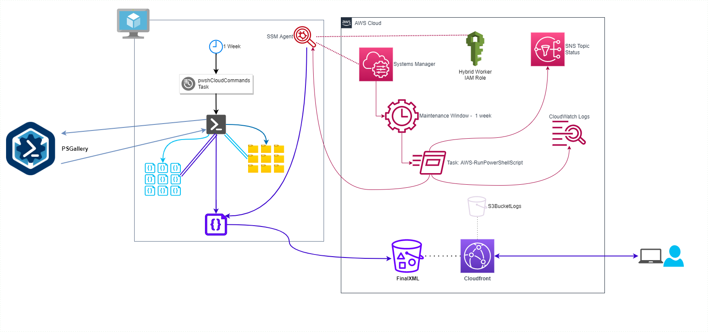

# pwshCloudCommands - Cache creation component

## Synopsis

pwshCloudCommands uses a cloud-based, event driven workflow to generate a dynamic cache of known PowerShell cloud commands.

This workflow continuously updates the known cache of PowerShell Cloud commands without any user involvement.

## Deployment Stack

* [Cloudformation for cache deployment](../cloudformation)

## Design Diagram

